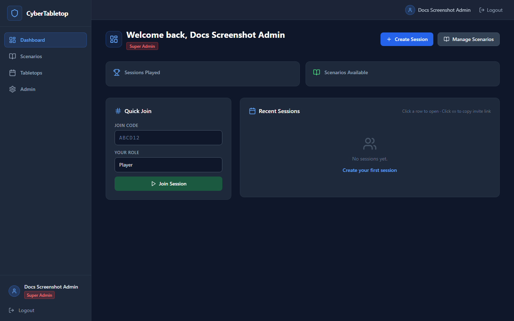
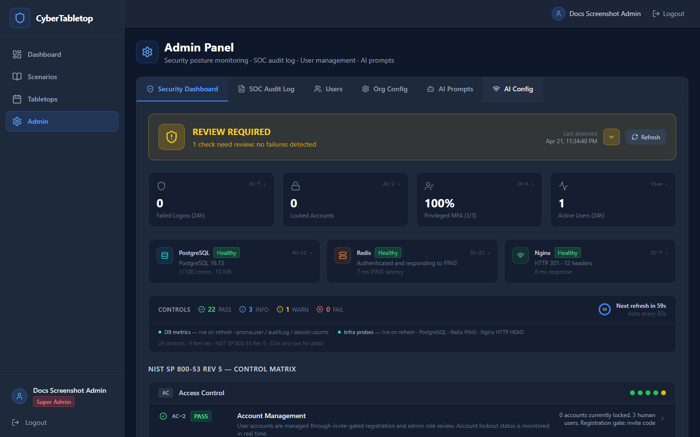
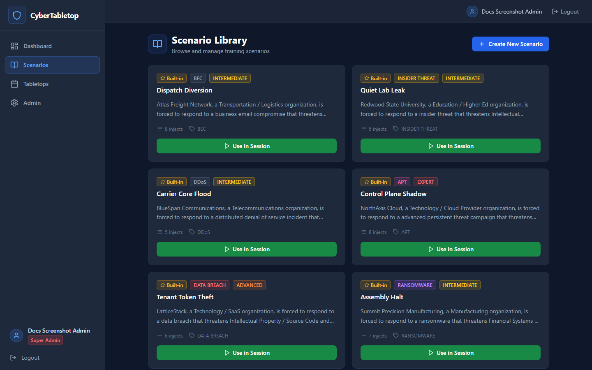
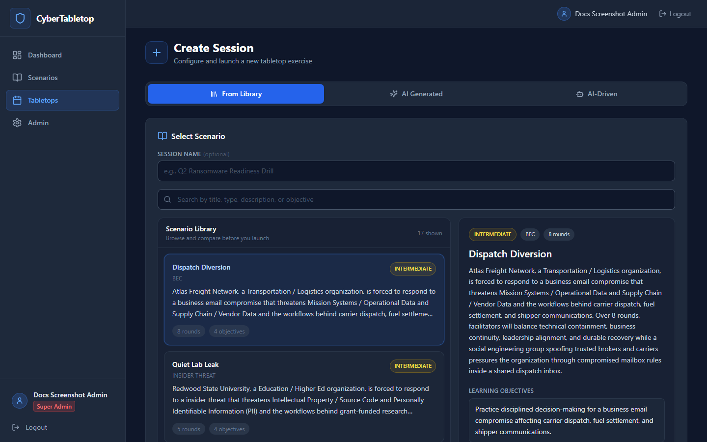
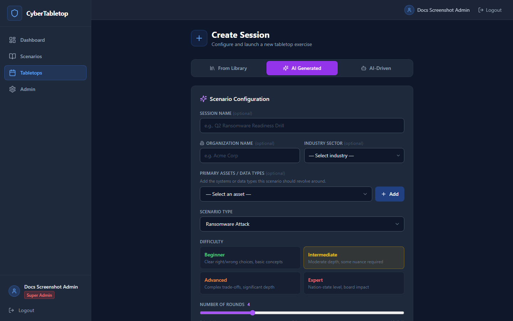
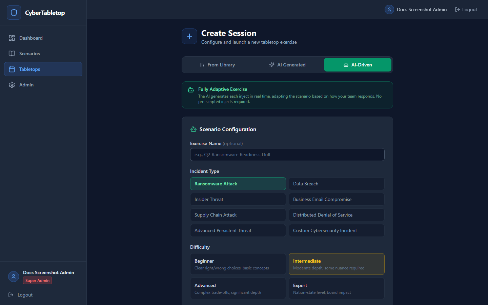

# CyberTabletop User Guide

This guide explains how to use CyberTabletop after it is installed.

## Core Concepts

CyberTabletop is organized around:

- users,
- roles,
- scenarios,
- sessions,
- injects,
- player decisions,
- scoring,
- debriefs.

A scenario is a reusable exercise template. A session is a live run of a scenario with participants.



## User Roles

| Role | Purpose |
| --- | --- |
| `SUPER_ADMIN` | Full platform administration |
| `ORG_ADMIN` | Organization-level administration |
| `FACILITATOR` | Build scenarios and run sessions |
| `PLAYER` | Join sessions and make decisions |

## First Login and Registration

If `REQUIRE_INVITE=true`, users need the `INVITE_CODE` from `.env` to register.

Steps:

1. Open CyberTabletop in a browser.
2. Click Register.
3. Enter display name, email, password, and invite code.
4. Sign in with the new account.
5. If your account is `SUPER_ADMIN`, `ORG_ADMIN`, or `FACILITATOR`, complete the TOTP MFA setup before continuing.

Passwords must meet the local password policy. If SSO/OIDC is configured, users may also sign in through the identity provider.

The first non-system account registered in a new deployment becomes `SUPER_ADMIN`.

## Admin Panel

Admins and facilitators can access the Admin panel from the left navigation.

The Admin panel includes:

- security dashboard,
- SOC audit log,
- users,
- organization config,
- AI prompts,
- AI config.



### Security Dashboard

The security dashboard reports operational checks such as:

- failed logins,
- locked accounts,
- privileged MFA coverage,
- active users,
- PostgreSQL probe,
- Redis probe,
- Nginx probe,
- NIST SP 800-53-oriented control status.

This dashboard is a monitoring aid. It is not a formal compliance attestation.

### SOC Audit Log

The audit log records significant actions. Use it to review authentication events, user changes, scenario/session actions, and other security-relevant activity.

### Users

Admins can review users and roles, change roles within their authority, and reset
MFA for another user when a verified lockout or authenticator replacement is
needed. Admins cannot reset MFA for themselves.

The built-in `system@cybertabletop.internal` user is an internal service identity used to own seeded/built-in scenario records. It is not intended for login.

## MFA

CyberTabletop uses time-based one-time passwords (TOTP) with authenticator apps
such as Microsoft Authenticator, Google Authenticator, 1Password, Bitwarden,
Authy, or Duo Mobile.

- `SUPER_ADMIN`, `ORG_ADMIN`, and `FACILITATOR` users must enroll MFA.
- `PLAYER` users may enable MFA from Profile.
- MFA recovery codes are shown once. Store them somewhere safe.
- If a user loses access to their authenticator and recovery codes, an admin can
  reset MFA from the Users tab after verifying the user's identity.

### Organization Config

Use Org Config to store organization context that can help AI-assisted scenario generation. Avoid entering secrets, credentials, real sensitive incidents, or regulated data unless your deployment and AI provider configuration are approved for that data.

### AI Config

CyberTabletop supports:

- `scripted`: deterministic built-in content and fallback behavior,
- `claude`: Anthropic API,
- `ollama`: local or network Ollama endpoint.

For internet-facing deployments, restrict admin access to AI configuration. AI endpoints and API keys are sensitive operational settings.

## Scenario Library

Open Scenarios to browse built-in and custom scenarios.

Built-in scenarios are seeded from the backend and owned by the internal system user.



For each scenario, facilitators can:

- review title, description, type, and difficulty,
- start a session from the scenario,
- edit custom scenarios where permitted.

## Creating a Scenario

Facilitators can create custom scenarios from the scenario builder.

A good scenario includes:

1. Clear objectives.
2. A realistic incident narrative.
3. Distinct phases.
4. Injects that reveal new information over time.
5. Decision options with meaningful tradeoffs.
6. Feedback explaining consequences.
7. NIST CSF or MITRE ATT&CK mappings where appropriate.

Keep scenario content realistic but avoid placing real secrets, customer data, or active incident details into the app unless your deployment is approved for that data.

## Creating a Session

The Create Session screen supports three exercise paths:

- **From Library**: use a built-in or custom scenario with a fixed inject sequence.
- **AI Generated**: ask the configured AI provider to create a complete scripted scenario before the exercise starts.
- **AI-Driven**: run a live adaptive exercise where each inject is generated during the session based on team decisions and facilitator context.



### From Library

Use this path when you want a repeatable exercise from the scenario library. Built-in scenarios are available immediately after install, and custom scenarios created by facilitators appear here as well.

To run a library exercise:

1. Sign in as a facilitator or admin.
2. Open Scenarios.
3. Select a scenario.
4. Start or create a session.
5. Configure the session options.
6. Share the join code with participants.

The session lobby shows participants as they join.

### AI Generated

AI Generated creates a complete scripted tabletop session up front. You choose the incident type, difficulty, number of rounds, and scenario details. CyberTabletop sends that request to the active AI provider and saves the generated injects before the exercise begins.

Use AI Generated when you want an AI-assisted scenario that still behaves like a normal scripted exercise. Facilitators can review the generated content before running the session.



### AI-Driven

AI-Driven creates a fully adaptive exercise. Instead of prebuilding every inject, CyberTabletop generates injects during the live session based on the scenario configuration, previous team decisions, and facilitator prompts.

Use AI-Driven when you want a more dynamic exercise where the situation can respond to participant choices in real time. This mode requires an active AI provider such as Claude or Ollama. The deterministic `scripted` provider is useful for built-in and fixed content, but it is not a substitute for live adaptive generation.



## Participant Join Flow

Players can join from:

```text
/join
```

or from a direct join link:

```text
/join/{join-code}
```

Players enter the join code and choose or receive their assigned exercise role.

## Running the Exercise

The facilitator controls the pace of the live session.

Typical flow:

1. Wait for participants in the lobby.
2. Assign or confirm roles.
3. Start the session.
4. Present each inject.
5. Let participants select decisions.
6. Reveal results and feedback.
7. Advance to the next inject.
8. Finish the session and move to debrief.

Players see the active inject, role-specific context, decision options, and scoring feedback.

## Scoring

Decision options can be weighted. Optimal choices generally score higher, but good scenario design should include plausible alternatives and tradeoffs.

Scores are intended for engagement and learning, not employee performance management.

## Debrief

The debrief view helps facilitators review:

- overall performance,
- player decisions,
- inject-by-inject outcomes,
- NIST CSF-oriented gaps,
- lessons learned,
- improvement themes.

Use the debrief to drive discussion:

- What did the team detect quickly?
- Where did coordination slow down?
- Which decisions depended on unclear authority?
- Which communications were missing?
- Which playbooks need updates?

## Suggested Operating Model

Before an exercise:

1. Confirm participants and roles.
2. Select or customize a scenario.
3. Test login/join flow.
4. Confirm projector/screen-sharing setup.
5. Explain that scores are for learning.

During an exercise:

1. Keep timeboxes tight.
2. Encourage role-based thinking.
3. Do not over-explain optimal decisions before reveal.
4. Capture observations outside the tool if needed.

After an exercise:

1. Review the debrief.
2. Identify top three gaps.
3. Assign owners and dates.
4. Update playbooks.
5. Schedule a follow-up exercise.

## Security Practices for Operators

- Keep `REQUIRE_INVITE=true` for public deployments.
- Use the built-in TOTP MFA for privileged local accounts.
- Use SSO/OIDC with upstream MFA where possible for stronger account lifecycle management.
- Limit admin roles.
- Review audit logs periodically.
- Back up PostgreSQL.
- Protect `.env`, Docker host access, and TLS private keys.
- Do not expose PostgreSQL or Redis ports publicly.

## Common Questions

### Do new users register themselves?

Yes, if registration is enabled. With `REQUIRE_INVITE=true`, they must know the invite code.

### What is `system@cybertabletop.internal`?

It is an internal service identity used for seeded/built-in data. It should not be used as a real login account.

### Can a company use CyberTabletop internally?

Yes. The Business Source License Additional Use Grant permits internal organizational use, including internal use by commercial organizations. See `LICENSE` and `COMMERCIAL.md`.

### Can someone sell CyberTabletop as SaaS?

No. Hosted service, managed service, white-label, resale, commercial training delivery, and bundling into commercial tools require separate permission.
